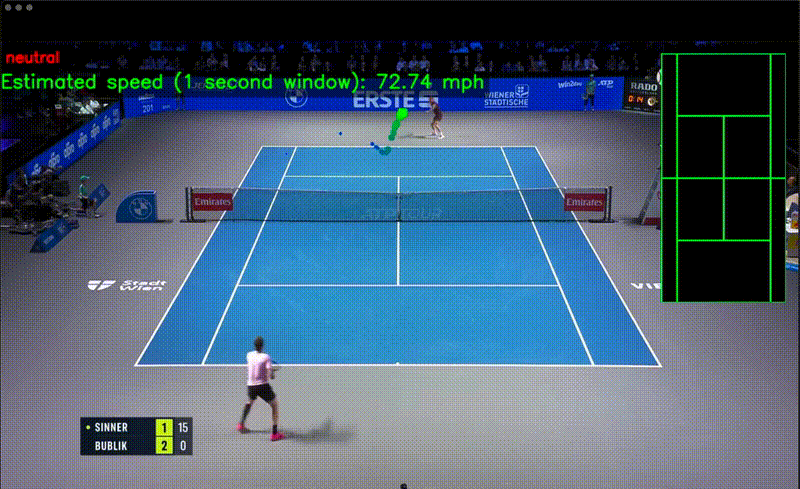

# 🎾 TennisTracker &nbsp; 

<p align="center">
  
  
  
  
  
  
  
  
  
</p>

<p align="center">
  
</p>

<p align="center">
  <b>Analyze tennis videos with AI: shot classification, ball tracking, court overlays, and more.</b><br>
  <i>For learners, hobbyists, coaches, and developers.</i>
</p>

---

## 🚀 Features

- 🎯 **Shot classification** using pose-based sequence modeling
- 🏃 **Neutral vs. swing state** detection
- 🟡 **Ball detection** and trail visualization
- 🏟️ **Court detection** and mini-court projection overlay
- 📤 **End-to-end video processing** with annotated output
- ☁️ **Cloudflare R2 upload** for processed videos

---

## 🛠️ System Overview

<details>
<summary><b>Backend Pipeline (FastAPI)</b></summary>

- Accepts video uploads, enforces size/type constraints
- YOLO-based human detection to crop player
- MediaPipe Pose for keypoint extraction
- Neutral-state classifier to gate shot classification
- Shot-type classifier for windowed frame sequences
- YOLO-based ball tracking and trail drawing
- Court detection and mini-court overlay
- Annotated video output, transcoded to MP4 via ffmpeg
- Uploads result to Cloudflare R2
</details>

<details>
<summary><b>Frontend Pipeline (Expo React Native)</b></summary>

- Authentication and video upload UI
- Calls backend `/process-video` endpoint
- Supabase for auth/session persistence
</details>

---

## 🗂️ Project Structure

```text
api/                  # FastAPI backend
  app.py              # Main backend pipeline
  serialized_models/  # Model artifacts for runtime
  temp_videos/        # Temporary video storage
frontend/             # Expo React Native app
src/
  shot_classification/  # Pose-based shot/neutral models
  ball_tracking/        # (Deprecated) Ball tracker training
  court_model/          # Court detection & YOLO assets
  shot_scoring/ball_speed/ # Ball speed/contact detection
serialized_models/     # Training outputs
data/                  # Training datasets
outputs/               # Rendered videos from tests
runs/                  # YOLO training runs/artifacts
```

---

## 🧠 Models & Assets

**Runtime models loaded by backend:**
- `yolo11n.pt` &nbsp; <sub>Human detector (player bounding boxes)</sub>
- `hugging_face_best.pt` &nbsp; <sub>Ball detector (YOLO weights)</sub>
- `src/court_model/best.pt` &nbsp; <sub>Court detector (YOLO weights)</sub>
- `api/serialized_models/shot_classifier.keras` &nbsp; <sub>Shot type classifier</sub>
- `api/serialized_models/neutrality.keras` &nbsp; <sub>Neutral state classifier</sub>

**Training/experimental models:**
See `serialized_models/` and `src/` subfolders for scripts and outputs.

---

## ⚡ Quickstart

### Backend
```bash
# 1. Create and activate a Python environment
# 2. Install dependencies
pip install -r requirements.txt
# 3. Start FastAPI server
uvicorn api.app:app --host 0.0.0.0 --port 5000
```

### Frontend
```bash
cd frontend
npm install
npx expo start
```

The frontend calls the backend at `http://localhost:5000` (see `frontend/lib/api.ts`).

---

## ⚙️ Environment Variables

Backend expects the following (see `api/app.py`):

```env
R2_ENDPOINT=...   # Cloudflare R2 endpoint URL
R2_KEY=...        # R2 access key
R2_SECRET=...     # R2 secret key
R2_BUCKET=...     # R2 bucket name
```

Place these in a `.env` file at the repo root. Loaded via `python-dotenv`.

---

## 📦 API Reference

### `POST /process-video`

- **Content-Type:** `multipart/form-data`
- **Body:** `video` file field
- **Accepted types:** `video/mp4`, `video/quicktime`, `video/x-matroska`
- **Size limit:** 150 MB
- **Rate limit:** 1 request/minute

**Response:**
```json
{
  "message": "video processed successfully",
  "url": "<r2-object-url>",
  "n_shots": 42,
  "most_common_shot": "forehand"
}
```

**Errors:**
- `400` Invalid file type or video
- `413` File too large or missing
- `500` Processing/upload error

---

## 🏋️ Training & Data Preparation

<details>
<summary><b>Shot Classification (Pose-based)</b></summary>

- Record data: `src/shot_classification/recorder.py` (webcam clips)
- Preprocess: `src/shot_classification/preprocess.py` (pose → `.npy`)
- Train: `src/shot_classification/trainer.py` (saves weights)
- Neutral state: `src/shot_classification/neutral_preprocess.py`, `neutral_trainer.py`
</details>

<details>
<summary><b>Ball Tracking (Deprecated)</b></summary>

- `src/ball_tracking/preprocess.py` (YOLO teacher labels)
- `src/ball_tracking/trainer.py` (disk-backed batches)
- `src/ball_tracking/model.py` (model definition)
</details>

<details>
<summary><b>Court Detection</b></summary>

- `src/court_model/train_yolo.sh` (YOLO training)
- `src/court_model/tester.py` (visualization)
</details>

<details>
<summary><b>Ball Speed & Contact Detection</b></summary>

- `src/shot_scoring/ball_speed/preprocess.py` (velocity labels)
- `src/shot_scoring/ball_speed/trainer.py` (ContactDetector)
- `src/shot_scoring/ball_speed/contact_model_tester.py` (inference/visualization)
</details>

---

## 📂 Outputs & Artifacts

- `outputs/` &nbsp; <sub>Rendered videos from tests</sub>
- `api/temp_videos/` &nbsp; <sub>Backend temp files</sub>
- `serialized_models/` &nbsp; <sub>Trained models (training scripts)</sub>
- `api/serialized_models/` &nbsp; <sub>Runtime models (backend)</sub>

---

## 🛠️ Troubleshooting

- Backend fails to start? → Check `ffmpeg` is installed and in `PATH`
- Upload errors? → Confirm `R2_*` env vars are set/valid
- Frontend cannot reach backend? → Update `API_URL` in `frontend/lib/api.ts` or ensure `uvicorn` is running
- Missing models? → Ensure `api/serialized_models/` contains `shot_classifier.keras`, `neutrality.keras`, and YOLO weights at repo root
- Slow processing? → Reduce input resolution or use a GPU

---

## 🗺️ Roadmap

- [ ] Shot scoring metrics: ball speed, depth, net clearance, outcome (in/out)
- [ ] Frontend completion & polish

---

> **Note:** Frontend is not fully completed yet.

---

## 👤 Author

**Ansh**

---

## 📄 License

This project is licensed under the [MIT License](LICENSE).