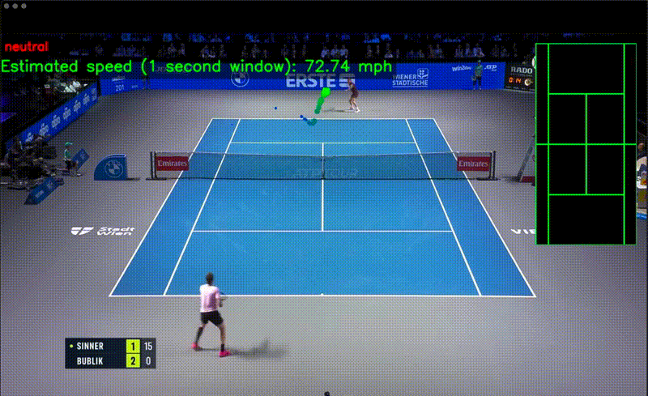

# 🎾 TennisTracker &nbsp; 

<p align="center">
  
  
  
  
  
  
  
  
  
</p>

<p align="center">
  
</p>

<p align="center">
  
</p>

<p align="center">
  <b>End-to-end tennis video analysis with computer vision and sequence models.</b><br>
  <i>Current scope: backend pipeline is production-ready with camera-aware routing; 3D reconstruction is on hold, frontend is mostly wrapped up.</i>
</p>

---

## 🚀 Features

- 🎯 **Shot classification** using pose-based sequence modeling
- 🏃 **Neutral vs. swing state** detection
- 🟡 **Ball detection** and trail visualization
- 🏟️ **Court detection** and mini-court projection overlay
- 📤 **End-to-end video processing** with annotated output
- ☁️ **Cloudflare R2 upload** for processed videos
- 🔀 **Camera-aware routing**: top-view clips → ball speed + tracking + 2D court minimap; court-level clips → shot classification + ball tracking
- 📈 **Metrics**: wrist velocity (court-level) and player movement heatmaps on a decaying density grid

---

## 📌 Project Status

| Area | Status | Notes |
|---|---|---|
| Backend video pipeline (`api/app.py`) | Active | Upload, branching logic, inference, annotation, and storage flow are integrated |
| Shot classification + neutral model | Active | Runs on court-level footage; attention-based temporal model |
| Ball tracking + court overlay | Active | YOLO + Savitzky–Golay smoothing, minimap homography on top-view |
| Reconstruction v2 (`src/reconstructionV2`) | Not pursuing | Monocular 3D dropped; code retained for reference only |
| Frontend (`frontend/`) | Mostly done | Core flows built; remaining polish/edge cases only |

---

## 🛠️ System Overview

<details>
<summary><b>Backend Pipeline (FastAPI)</b></summary>

- Accepts video uploads, enforces size/type constraints
- YOLO-based human detection to crop player
- MediaPipe Pose for keypoint extraction
- Neutral-state classifier to gate shot classification
- Shot-type classifier for windowed frame sequences
- YOLO-based ball tracking and trail drawing
- Court detection and mini-court overlay
- Branching: court detector confidence > 0.5 ⇒ `view_type="top"` (enables homography, minimap, ball speed); otherwise `view_type="court"` (shot classifier + tracking only)
- Annotated video output, transcoded to MP4 via ffmpeg
- Uploads result to Cloudflare R2
</details>

<details>
<summary><b>Mini-Court Homography Overlay</b></summary>

- Court detection (YOLO) picks the largest box; baseline length -> meters-per-pixel for speed.
- Far baseline is shrunk with a tunable ratio `k` plus padding to approximate perspective.
- Four court corner points (top/bottom × left/right) are mapped to a fixed mini-court (200×400 px at top-right) via `cv.findHomography`.
- `cv.perspectiveTransform` projects the detected ball location into the mini-court; result is clamped to overlay bounds and rendered in yellow.
- The same homography keeps the mini-court aligned even as the main video resizes to 1280×720.
</details>

<details>
<summary><b>Frontend Pipeline (Expo React Native)</b></summary>

- Authentication and video upload UI
- Calls backend `/process-video` endpoint
- Supabase for auth/session persistence
</details>

---

## ✨ Inspiration
I play a lot of tennis and wanted a cross-platform, budget-friendly alternative to SwingVision (which is iOS-only and pricey). This project is my way of making high-quality analytics accessible to more players.

## 🧩 How It Works (Methodology & Challenges)

1. **Shot classification (court-level clips):** Recorded hundreds of strokes, cropped the player with YOLO, extracted pose keypoints via MediaPipe, and fed temporal pose tensors (ℝ^(T×33×3)) into an attention-based model to learn decisive moments. Trained with Adam + SCCE, batching/shuffling, and L2 regularization for confident, generalizable predictions.
2. **Ball tracking:** Started with TrackNet but pivoted to a fine-tuned YOLO detector plus Savitzky–Golay smoothing and gradient trails to cut jitter while preserving trajectory curvature.
3. **Court detection & homography:** Fine-tuned a YOLO court detector. Derived a shrink factor on the far baseline to approximate perspective, then computed homography to a fixed minimap for top-view inputs.
4. **2D court modeling (top-view clips):** Detected court corners + smoothed ball tracks → homography → minimap overlay with clamped positions for stability.
5. **Ball speed estimation (top-view clips):** Court box height → meters-per-pixel (uses 23.77 m baseline), 1-second rolling buffer (≈fps frames) → velocity in mph; disabled on court-level clips where depth ambiguity would mislead speed.
6. **Wrist velocity (court-level):** YOLO isolates the player, MediaPipe Pose extracts wrists, per-wrist buffers (len=60) compute smoothed speeds with dt from video fps; scaling uses assumed 1.82 m player height; exponential smoothing (α=0.75) and jump rejection tame spikes.
7. **Player movement heatmap (court-level):** Court box defines a 200×400 minimap grid; feet position (midpoint of player bbox bottom edge) is accumulated into a decaying heatmap (0.995 frame decay) to visualize movement density; exported as colored PNG.

Branching logic ties these pieces together: top-view videos get ball speed, tracking, and 2D minimap; court-level videos run shot classification, ball tracking, wrist velocity, and movement heatmaps.

---

## 🗂️ Project Structure

```text
api/                  # FastAPI backend
  app.py              # Main backend pipeline
  serialized_models/  # Model artifacts for runtime
  temp_videos/        # Temporary video storage
frontend/             # Expo React Native app
src/
  shot_classification/  # Pose-based shot/neutral models
  ball_tracking/        # Ball tracker training
  court_model/          # Court detection & YOLO assets
  metrics/              # Shot scoring, ball speed, wrist velocity, movement heatmaps (court-level)
serialized_models/     # Training outputs
data/                  # Training datasets
outputs/               # Rendered videos from tests
runs/                  # YOLO training runs/artifacts
```

---

## 🧠 Models & Assets

**Runtime models loaded by backend:**
- `yolo11n.pt` &nbsp; <sub>Human detector (player bounding boxes)</sub>
- `hugging_face_best.pt` &nbsp; <sub>Ball detector (YOLO weights)</sub>
- `src/court_model/best.pt` &nbsp; <sub>Court detector (YOLO weights)</sub>
- `api/serialized_models/shot_classifier.keras` &nbsp; <sub>Shot type classifier</sub>
- `api/serialized_models/neutrality.keras` &nbsp; <sub>Neutral state classifier</sub>

**Training/experimental models:**
See `serialized_models/` and `src/` subfolders for scripts and outputs.

---

## ⚡ Quickstart

### Backend
```bash
# 1) Create and activate a Python 3.10+ virtual environment
# 2) Install dependencies
pip install -r requirements.txt
# 3) Start the FastAPI server
uvicorn api.app:app --host 0.0.0.0 --port 5000
```

### Frontend
```bash
cd frontend
npm install
npx expo start
```

The frontend calls the backend at `http://localhost:5000` (see `frontend/lib/api.ts`).
`ffmpeg` must be installed and available in `PATH` for output video conversion.

---

## ⚙️ Environment Variables

Backend expects the following (see `api/app.py`):

```env
R2_ENDPOINT=...   # Cloudflare R2 endpoint URL
R2_KEY=...        # R2 access key
R2_SECRET=...     # R2 secret key
R2_BUCKET=...     # R2 bucket name
```

Place these in a `.env` file at the repo root. Loaded via `python-dotenv`.

---

## 📦 API Reference

### `POST /process-video`

- **Content-Type:** `multipart/form-data`
- **Body:** `video` file field
- **Accepted types:** `video/mp4`, `video/quicktime`, `video/x-matroska`
- **Size limit:** 150 MB
- **Rate limit:** 1 request/minute
- **Routing:** the backend auto-detects camera angle; high-confidence court detection (`>0.5`) triggers top-view branch (ball speed + minimap), otherwise court-level branch (shot classification + tracking + metrics).

**Response (both branches):**
```json
{
  "message": "video processed successfully",
  "url": "<signed_r2_url>",
  "expires_in": 3600
}
```
- `url` points to the annotated MP4 (720p) stored in R2 with a 1-hour signed URL.
- Heatmaps (top-view minimap overlay; court-level movement heatmap PNG) are currently saved locally during processing for debugging and are not returned in the API payload.

**Errors:**
- `400` Invalid file type or video
- `413` File too large or missing
- `500` Processing/upload error

---

## 🏋️ Training & Data Preparation

<details>
<summary><b>Shot Classification (Pose-based)</b></summary>

- Record data: `src/shot_classification/recorder.py` (webcam clips)
- Preprocess: `src/shot_classification/preprocess.py` (pose → `.npy`)
- Train: `src/shot_classification/trainer.py` (saves weights)
- Neutral state: `src/shot_classification/neutral_preprocess.py`, `neutral_trainer.py`
</details>

<details>
<summary><b>Ball Tracking</b></summary>

- `src/ball_tracking/preprocess.py` (YOLO teacher labels)
- `src/ball_tracking/trainer.py` (disk-backed batches)
- `src/ball_tracking/model.py` (model definition)
</details>

<details>
<summary><b>Court Detection</b></summary>

- `src/court_model/train_yolo.sh` (YOLO training)
- `src/court_model/tester.py` (visualization)
</details>

<details>
<summary><b>Metrics (ball speed / shot scoring)</b></summary>

- `src/metrics/preprocess.py` (velocity labels)
- `src/metrics/trainer.py` (ContactDetector / scoring)
- `src/metrics/contact_model_tester.py` (inference/visualization)
- `src/metrics/wrist_velocity/velocity.py` (per-wrist speed on court-level clips)
- `src/metrics/player_movement/movement.py` (movement heatmaps on court-level clips)
</details>

---

## 📂 Outputs & Artifacts

- `outputs/` &nbsp; <sub>Rendered videos from tests</sub>
- `api/temp_videos/` &nbsp; <sub>Backend temp files</sub>
- `serialized_models/` &nbsp; <sub>Trained models (training scripts)</sub>
- `api/serialized_models/` &nbsp; <sub>Runtime models (backend)</sub>

---

## 🛠️ Troubleshooting

- Backend fails to start? → Check `ffmpeg` is installed and in `PATH`
- Upload errors? → Confirm `R2_*` env vars are set/valid
- Frontend cannot reach backend? → Update `API_URL` in `frontend/lib/api.ts` or ensure `uvicorn` is running
- Missing models? → Ensure `api/serialized_models/` contains `shot_classifier.keras`, `neutrality.keras`, and YOLO weights at repo root
- Slow processing? → Reduce input resolution or use a GPU

---

## 🗺️ Roadmap

- [ ] Further tune top-view branch (ball speed + minimap stability)
- [ ] Expand metrics in `src/metrics` (depth, clearance, outcomes)
- [ ] Throughput/latency hardening for multi-YOLO + Mediapipe pipeline
- [ ] Frontend polish and device testing

---

## 🔭 Next Steps

- **Reconstruction:** not planned—monocular depth is too ill-posed for reliable production use without multi-camera data.
- **Frontend:** wrap remaining polish items (edge cases, UX fit/finish) and ship alongside the stabilized backend.

---

## 📄 License

This project is licensed under the [MIT License](LICENSE).
