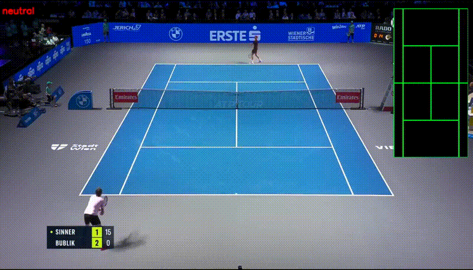

# TennisTracker

TennisTracker is a computer-vision pipeline that analyzes tennis videos to detect shots, track the ball, and visualize play on a mini-court overlay. The project combines a FastAPI backend for video processing with a React Native (Expo) frontend, plus a set of training and preprocessing scripts for building the underlying models.

This README documents the current architecture, runtime setup, model assets, training workflows, and project layout based on the code in this repository.

**Table Of Contents**
1. Overview
2. Current Capabilities
3. System Architecture
4. Project Layout
5. Models And Assets
6. Setup
7. Environment Variables
8. Running Locally
9. API Reference
10. Training And Data Preparation
11. Outputs And Artifacts
12. Troubleshooting
13. Roadmap

**Overview**
TennisTracker focuses on extracting actionable insights from broadcast or court-level tennis footage. The core pipeline:
1. Detects and tracks the player and ball frame-by-frame.
2. Extracts pose keypoints via MediaPipe to classify shot type.
3. Detects the tennis court and projects ball position onto a mini-court overlay.
4. Writes an annotated output video and uploads it to Cloudflare R2 storage.

The backend exposes a single endpoint that accepts a video upload and returns a URL to the processed video.
Not perfect, shot classification jumps around, but typically infers correctly at contact time.



**Current Capabilities**
- Shot classification using pose-based sequence modeling.
- Neutral versus swinging state detection to gate shot predictions.
- Ball detection and trail visualization.
- Court detection and mini-court projection overlay.
- End-to-end processing of uploaded videos with a generated output file.
- Upload of processed videos to Cloudflare R2.

**System Architecture**
Backend pipeline (`api/app.py`):
- Ingests a video upload and enforces size/type constraints.
- Runs YOLO-based human detection to crop the player.
- Uses MediaPipe Pose to extract keypoints.
- Runs a neutral-state classifier to decide when to classify a shot.
- Runs a shot-type classifier to label a windowed frame sequence.
- Tracks the tennis ball with a YOLO detector and draws a trail.
- Detects the court, draws a mini-court overlay, and projects the ball location.
- Writes the annotated video, transcodes to MP4 via `ffmpeg`, and uploads to R2.

Frontend pipeline (`frontend/`):
- Expo React Native app for authentication and video upload.
- Calls the backend `/process-video` endpoint with multipart form data.
- Uses Supabase for auth and session persistence.

**Project Layout**
- `api/`
- `api/app.py` FastAPI backend that runs the full video processing pipeline.
- `api/serialized_models/` Backend model artifacts used at runtime.
- `api/temp_videos/` Temporary input/output video storage.
- `frontend/` Expo React Native application.
- `src/shot_classification/` Pose-based shot classification and neutral state models.
- `src/ball_tracking/` Deprecated spatiotemporal ball tracker training pipeline.
- `src/court_model/` Court detection experiments and YOLO training assets.
- `src/shot_scoring/ball_speed/` Contact detection model for ball speed estimation.
- `serialized_models/` Training outputs used by scripts in `src/`.
- `data/` Training data and datasets (not fully listed here).
- `outputs/` Rendered videos from local testing scripts.
- `runs/` YOLO training runs and artifacts.

**Models And Assets**
Runtime models and weights are loaded directly in the backend:
- `yolo11n.pt` Human detector (player bounding boxes).
- `hugging_face_best.pt` Ball detector (YOLO weights).
- `src/court_model/best.pt` Court detector (YOLO weights).
- `api/serialized_models/shot_classifier.keras` Shot type classifier.
- `api/serialized_models/neutrality.keras` Neutral state classifier.

Training and experimental models live under `serialized_models/` and `src/` as noted in the training sections below.

**Setup**
Backend prerequisites:
- Python 3.10+ recommended.
- `ffmpeg` available on the system `PATH` (used for AVI to MP4 conversion).
- GPU is optional but recommended for model training.

Frontend prerequisites:
- Node.js 18+ recommended.
- Expo CLI (installed via `npx expo` or globally).

**Environment Variables**
The backend expects the following values (used in `api/app.py`):
- `R2_ENDPOINT` Cloudflare R2 endpoint URL.
- `R2_KEY` R2 access key.
- `R2_SECRET` R2 secret key.
- `R2_BUCKET` R2 bucket name.

These are typically placed in a `.env` file at the repository root and loaded via `python-dotenv`.

**Running Locally**
Backend:
1. Create and activate a Python environment.
2. Install dependencies from `requirements.txt`.
3. Start FastAPI using Uvicorn.

Example:
```bash
pip install -r requirements.txt
uvicorn api.app:app --host 0.0.0.0 --port 5000
```

Frontend:
1. Install dependencies in `frontend/`.
2. Start Expo.

Example:
```bash
cd frontend
npm install
npx expo start
```

The frontend calls the backend at `http://localhost:5000` as defined in `frontend/lib/api.ts`.

**API Reference**
`POST /process-video`
- Content-Type: `multipart/form-data`
- Body: `video` file field
- Accepted types: `video/mp4`, `video/quicktime`, `video/x-matroska`
- Size limit: 150 MB
- Rate limit: 1 request per minute (configured in `api/app.py`)

Response:
```json
{
  "message": "video processed successfully",
  "url": "<r2-object-url>",
  "n_shots": 42,
  "most_common_shot": "forehand"
}
```

Errors:
- `400` invalid file type or invalid video.
- `413` file too large or missing.
- `500` processing error or upload failure.

**Training And Data Preparation**
Shot classification (pose-based):
- Record data: `src/shot_classification/recorder.py` captures labeled clips via webcam.
- Preprocess videos: `src/shot_classification/preprocess.py` extracts pose sequences and writes `.npy` files to `data/shot-classification/landmarks/`.
- Train classifier: `src/shot_classification/trainer.py` trains a `ShotClassifier` and saves weights.
- Neutral state model:
- `src/shot_classification/neutral_preprocess.py` extracts pose frames from still images.
- `src/shot_classification/neutral_trainer.py` trains the `NeutralIdentifier` model.

Ball tracking (deprecated spatiotemporal model):
- `src/ball_tracking/preprocess.py` generates labeled sequences using a YOLO teacher model.
- `src/ball_tracking/trainer.py` trains `BallTracker` on disk-backed batches.
- `src/ball_tracking/model.py` defines the model.

Court detection:
- `src/court_model/train_yolo.sh` trains a YOLO detector on court bounding boxes.
- `src/court_model/tester.py` validates ball and court overlay visualizations.

Ball speed and contact detection:
- `src/shot_scoring/ball_speed/preprocess.py` builds sequence labels based on abrupt velocity changes.
- `src/shot_scoring/ball_speed/trainer.py` defines training for `ContactDetector`.
- `src/shot_scoring/ball_speed/contact_model_tester.py` runs inference and renders contact windows.

**Outputs And Artifacts**
- `outputs/` contains rendered videos from testing scripts.
- `api/temp_videos/` holds temporary input/output files during backend processing.
- `serialized_models/` includes trained models used by training scripts.
- `api/serialized_models/` includes models used by the backend runtime.

**Troubleshooting**
- Backend fails to start: verify `ffmpeg` is installed and in `PATH`.
- Upload errors: confirm `R2_*` environment variables are set and valid.
- Frontend cannot reach backend: update `API_URL` in `frontend/lib/api.ts` or ensure `uvicorn` is running on port 5000.
- Missing models: ensure `api/serialized_models/` contains `shot_classifier.keras` and `neutrality.keras`, and the YOLO weights exist at repo root.
- Slow processing: reduce input resolution or use a GPU machine.

**Roadmap**
Planned features and in-progress work:
- Following metrics for shot scoring:
  1. Ball speed
  2. Depth
  3. Net clearance
  4. Outcome (in/out)

**WARNING**
> Frontend has not being completed yet