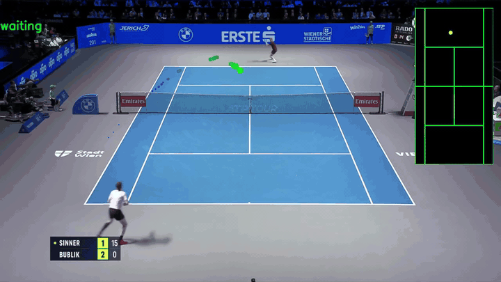
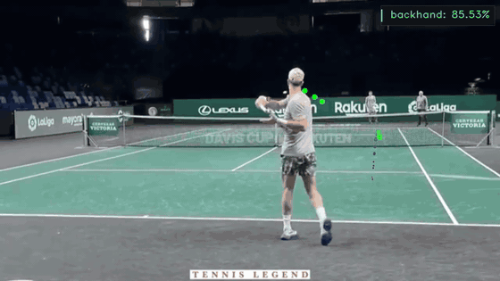

# 🎾 TennisTracker &nbsp; 

A cross-platform tennis analytics platform that runs a full computer-vision pipeline on uploaded match footage — classifying shots, tracking the ball, estimating speed, and rendering pose data in 3D. Inspired by SwingVision but open, budget-friendly, and works on any camera angle.

---

## Inspiration

I play tennis — a lot — and it's a core part of my life. I tried SwingVision recently, which was impressive, but it's expensive, iOS-only, and locks you into their ecosystem. The vast majority of Android users have no equivalent. I decided to build a cross-platform version from scratch with the same core features, and ended up going considerably deeper into the CV side than I initially expected.

---

## Demo

| Court-level view | Top-level view |
|:---:|:---:|
|  |  |

---

## Stack

**Backend**

| Tool | Role |
|---|---|
| TensorFlow | Shot classifier and neutral-position model training + inference |
| MediaPipe BlazePose | Pose keypoint extraction (33 landmarks, x/y/z) |
| YOLO (ultralytics) | Human detection, fine-tuned court detection, fine-tuned ball tracking |
| OpenCV | Video I/O, homography computation, overlay rendering |
| NumPy | Mathematical operations, tensor manipulation |
| FastAPI + SlowAPI | REST API with rate limiting |
| SciPy / librosa | Savitzky-Golay smoothing, audio-based contact detection |
| Boto3 | Cloudflare R2 storage for processed videos |

**Frontend**

| Tool | Role |
|---|---|
| React + TypeScript | Routing, state, and backend communication |
| Tailwind CSS | Styling |
| ApexCharts.js | Interactive velocity and shot distribution graphs |
| Supabase | Authentication and session/statistics database |
| React Three Fiber + Three.js | 3D pose wireframe rendering |

---

## Backend: How It Works

### View Classification

The pipeline splits into two paths based on camera angle — **court-level** (player fills the frame, camera behind the baseline) and **top-level** (overhead broadcast angle with full court visible). Most similar projects only support top-level footage because it provides more spatial information. I prioritized court-level support since most recreational players don't have access to an elevated camera angle.

I trained a YOLOv11 model to detect tennis courts and discovered it doubled as a natural view classifier: if the model detects a court bounding box with confidence above 0.5, the video is top-level; otherwise it's court-level. This gates which features run downstream — the minimap and speed estimation only activate for top-level footage.

---

### Shot Classification

**Methodology**

I couldn't find usable online datasets — the ones I found were low quality and inconsistently labeled. So I recorded a few hundred videos of myself performing various shots in my basement, cropped out the player using YOLO, extracted pose keypoints with MediaPipe, and built my own dataset.

Each stroke is encoded as a temporal tensor over MediaPipe's 33 BlazePose landmarks:

$$X \in \mathbb{R}^{T \times 33 \times 3}$$

where T is the number of frames and each landmark carries (x, y, z) coordinates. This encodes the full motion arc of a stroke rather than a single static pose, which is what makes the classifier generalizable across players — the kinematics of a forehand are fundamentally different from a backhand regardless of who hits it.

An attention-based temporal model learns which frames within the sequence carry the most discriminative signal, improving robustness when keypoints are noisy or the player appears small in frame. A second model (`neutrality.keras`) gates the classifier entirely — it only triggers inference when the player is actively swinging, preventing false positives during neutral stances between rallies.

*Shot label (top-right), ball gradient trail, and tracked right wrist (red dot) on a Davis Cup match.*

**Problems faced**

- *MediaPipe fails on tiny/occluded players in broadcast footage* → Fixed by first cropping the player with YOLO and running MediaPipe only on that crop. This also gives player-local coordinates for wrist tracking downstream.
- *No usable public dataset* → Recorded own dataset from scratch in a controlled environment, which ended up generalizing better than expected because the structural differences between strokes (forehand vs. backhand rotation, serve arm extension) are consistent across people.

---

### Ball Tracking

**Methodology**

I first attempted to implement a **TrackNet** architecture from scratch. TrackNet uses a sequence of stacked frames as input and outputs a heatmap of predicted ball positions. This ran into two hard walls: the input sequences produced very large tensors that caused out-of-memory errors, and the resulting heatmaps were frequently empty — the model struggled with the low contrast between a moving ball and the court background.

Instead, I used a fine-tuned YOLO ball detection model from HuggingFace and augmented it with a **Savitzky-Golay filter** — a least-squares polynomial fit over a sliding window that smooths the trajectory while preserving curvature:

$$\hat{y}_i = \sum_{k=-m}^{m} c_k \, y_{i+k}$$

This eliminates high-frequency jitter from bounding-box variance without the phase distortion a simple moving average would introduce (which would make bounces look rounded instead of sharp). When multiple ball candidates appear in a frame, the one closest to the previous known position is selected to prevent the tracker jumping to background noise.

**Problems faced**

- *TrackNet: OOM errors and empty heatmaps* → Abandoned the architecture entirely after hitting repeated dead ends. The problem was data scale + model complexity for a single-GPU setup.
- *Raw YOLO detections are too jittery for trajectory analysis* → Added the Savitzky-Golay filter with a sliding window, which made trajectories smooth enough to unlock speed estimation and the minimap.

---

### Court Detection

**Methodology**

My first approach was a **Hough transform** paired with a **Canny edge detector** to extract the major court lines. It found lines, but the results were crude, highly sensitive to lighting and camera angle, and completely non-generalizable to different court surfaces and backgrounds.

I switched to fine-tuning YOLOv11 on a dataset of tennis court images, which gave reliable bounding boxes. The new problem: YOLO outputs axis-aligned rectangles, but tennis courts appear as trapezoids in perspective footage. The far baseline is visually narrower than the near baseline.

To fix this without full 3D reconstruction, I derived a geometric scaling factor from the bounding box's height-to-width ratio to approximate how much the far baseline compresses under perspective projection. This gave the four approximate court corner coordinates needed to compute the homography matrix for the minimap.

**Problems faced**

- *Hough + Canny: not generalizable* → Hard lines approach failed across different surfaces, lighting, and angles. Fine-tuned YOLO solved generalization cleanly.
- *YOLO can't output trapezoids* → Derived the perspective compression factor geometrically from the detected box dimensions rather than requiring labeled corner points.

---

### 2D Court Minimap

**Methodology**

With the four approximate court corners in hand, I compute a homography matrix H that maps any point in the camera frame to its corresponding position on a scale-accurate minimap:

$$\mathbf{x'} \sim H\mathbf{x}, \quad H \in \mathbb{R}^{3 \times 3}$$

The minimap is drawn with real court proportions (singles/doubles sidelines, service boxes, net) and the ball's smoothed position is projected into it in real time.

**Problems faced**

- *First attempt: manual court labeling + homography* → Required users to click court corners before each video, which was impractical and introduced instability from monocular depth ambiguity. Small errors in corner placement caused large warps in the minimap.
- *Second attempt: ratio-based coordinate mapping without homography* → Skipped the matrix entirely and used normalized ratios to place the ball. This removed the depth error but introduced visible perspective warping — the ball appeared in the wrong position when near the baselines.
- *Third attempt (current): homography with dynamically detected corners* → Once YOLO was detecting courts reliably and ball tracking was smooth enough, I tried homography again using the dynamically computed court corners. The perspective warps became nearly imperceptible. The combination of accurate corner detection and smooth ball positions was what the earlier attempts were missing.

*Top-level view showing real-time ball speed, gradient trail, and homography-mapped minimap (top-right).*

---

### Ball Speed Estimation

**Methodology**

The core problem: the camera sees 2D pixel motion, not 3D real-world distance. A ball moving directly toward the camera covers many pixels per frame but very little real-world ground.

To approximate real-world distance from pixels, I use the detected court baseline as a reference — the real baseline is 23.77 m:

$$\text{mpp} = \frac{L_{\text{real}}}{L_{\text{pixels}}}$$

Velocity is then computed over a 1-second rolling buffer of ball positions and converted to mph. Only active for top-level footage where the full baseline is visible.

**Problems faced**

- *Simple V = (final − initial) / time gave wildly unstable readings* → A single noisy detection at either endpoint would corrupt the whole measurement. Switching to a rolling 1-second buffer and clearing it after each measurement smoothed out the readings significantly.

---

### Contact Detection

**Methodology**

Detecting ball-racket contact is one of the hardest parts of the pipeline because the contact itself isn't directly visible — you can only infer it from secondary signals.

I tried three approaches before finding one that worked:

1. **ML model trained to predict contact frames** — Too difficult to label accurately and the model overfit to visual patterns that don't generalize.
2. **Ball velocity spikes** — A real contact causes a direction reversal and speed change, but detection jitter produced enough false velocity spikes to make this unreliable.
3. **Ball direction changes** — Same problem. Noisy detections triggered false positives constantly.

The solution was audio. When a ball hits a racket, it produces a sharp, high-energy transient that stands out clearly from background noise. I extract the audio track with ffmpeg, load it with librosa, compute a per-video adaptive energy threshold above the mean RMS floor, and flag frames where the audio energy crosses that threshold. A 150 ms cooldown prevents double-counting a single hit. This approach missed only a few contacts out of 25–30 in testing.

---

### Wrist Velocity

**Methodology**

Wrist speed is a key indicator of shot quality in tennis — it directly correlates with racket head speed at contact.

The naive approach (track wrist pixel position in the full frame, apply velocity formula) produces enormous numbers during rallies because the player is also moving across the court. The wrist velocity you compute is dominated by player movement, not the actual wrist motion relative to the body.

The fix: compute wrist position in **player-local coordinates** by running MediaPipe inside the YOLO-cropped player bounding box. This makes the wrist position relative to the player's body regardless of how much the player moves. Pixel velocity is then converted to mph using a player-height-based scale estimate (assuming 1.82 m average height).

*Red dot marks the tracked right wrist. Shot label updates as the rally progresses.*

---

### 3D Pose Visualization

Per-frame MediaPipe landmarks are normalized (root-centered at the hip midpoint, scaled by torso length) and returned in the API response. The frontend renders them as an interactive 3D wireframe using React Three Fiber with orbit controls, letting users inspect body position at any point in the rally.

---

## Frontend: How It Works

The frontend is built with React and TypeScript, styled with Tailwind CSS, with routing via React Router. Supabase handles authentication and stores session metadata (video URLs, shot statistics, timestamps). Results are displayed with interactive ApexCharts graphs for wrist velocity and shot distribution, and a React Three Fiber canvas for the 3D pose.

**Problems faced**

- *Passing API response data through to Supabase and back to the result page* — The pipeline response is large and deeply nested. Getting the data saved correctly and retrieved in the right shape on the result page took significant iteration, and my unfamiliarity with SQL made the Supabase schema design more challenging than expected.
- *Values not rendering correctly on the result page* — Some fields arrived as null or in unexpected formats (NaN, Infinity from NumPy serialization). Added `safe_float()` sanitization on the backend to convert these before the response leaves the server.
- *Graph polish* — ApexCharts defaults needed considerable configuration to look clean rather than generic. Axis formatting, tooltip customization, and responsive sizing all required extra time.

---

## What I Learned

CV systems in production are fundamentally different from CV systems in a notebook. They need to handle bad lighting, arbitrary camera angles, varying player sizes, and frame-level noise — all in real time. The biggest recurring lesson was that simpler signal processing (Savitzky-Golay smoothing, audio RMS thresholding) consistently outperformed more complex ML approaches when the training data was limited. Speed vs. accuracy tradeoffs also mattered more than expected: running multiple YOLO instances, MediaPipe, and TF inference concurrently required careful frame-skipping and result caching to stay within acceptable processing time.

---

## What's Next

Monocular 3D ball reconstruction is the logical extension. A 2D trajectory corresponds to infinitely many 3D paths — solving this without multiple cameras requires either stereo vision or learned depth priors from large datasets. A handful of research groups have done it under constrained conditions with significant compute; following their approach is the most promising direction.

---

## Deployment Note

The pipeline runs multiple YOLO instances, MediaPipe nets, and TensorFlow models concurrently on 720p footage. Free-tier cloud hosts are CPU-bottlenecked and RAM-constrained to the point of making the UX unusable. GPU-backed or high-RAM compute is required for a production deployment.

---

## Targeted Users

Anyone from complete beginners to seasoned professionals — the pipeline is view-agnostic and designed to handle the variation in camera angles typical of recreational and broadcast footage alike.
